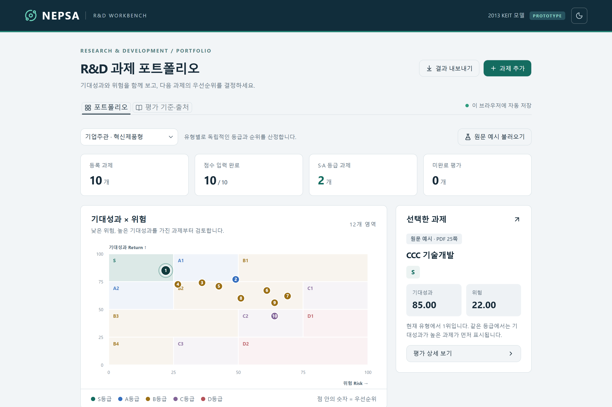
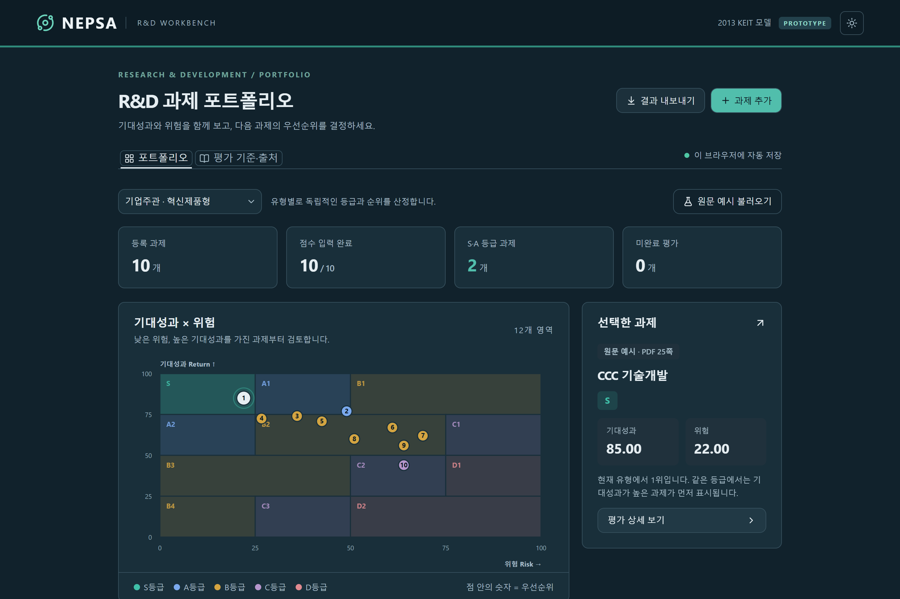

# NEPSA · R&D 과제 포트폴리오 워크벤치

R&D 기획과제를 **기대성과(Return)** 와 **위험(Risk)** 두 축으로 평가해 등급과 우선순위를 매기는 웹 앱입니다. 한국산업기술평가관리원(KEIT)이 2013년 공개한 보고서의 NEPSA 방법론을 바탕으로 구현했으며, 원문에 없는 산식과 후속 자료 해석은 별도 가정으로 명시합니다.

과제마다 12개 지표를 입력하면 100점 환산 점수 두 개가 나오고, 그 좌표가 12개 영역 매트릭스 위에서 S~D 등급과 순위로 이어집니다.

NEPSA는 보고서 18쪽(인쇄 098쪽)에 `Nest yEar Projects Selection Analysis`로 풀려 있습니다. 문맥상 "Next Year"의 오타로 보이지만 표기는 원문을 따랐습니다. 다른 기관 자료(KISTEP 2017, 국토교통과학기술진흥원 2021)는 같은 약어를 `NExt Project Selection Analysis`로 풉니다 — [외부 자료 조사](docs/nepsa-external-sources-2026-09-06.md). 방법론 자체를 설명하는 화면은 앱의 **NEPSA란?** 탭에 있습니다.

> **비공식 재현입니다.** KEIT와 무관하며, 공개된 2013년 보고서만 보고 구현했습니다. 세부 산식이 현재 KEIT 실무 기준과 같다는 보장은 없습니다. 실제 과제 평가에 쓰기 전에 반드시 원문과 최신 지침을 확인하세요.

| 라이트 | 다크 |
| --- | --- |
|  |  |

예시 과제를 불러온 상태입니다. 테마는 상단바 오른쪽 버튼으로 바꿉니다.

## 무엇을 하는가

2026-09-06 추가: **분석·이력·비교** 탭에서 지표 기여점수, 시나리오 전후 순위, 평가 이력과 최대 4개 과제 비교를 확인할 수 있습니다. 시나리오는 원본과 분리되어 있으며, 이력과 시나리오는 각각 전용 JSON으로 백업합니다. 지표별 출처·기준연도·가정·확신도를 기록하고 Excel용 상세 CSV로 내보낼 수 있습니다. [기능과 검증 내역](docs/analysis-audit-2026-09-06.md)을 참고하세요.

- **12개 지표 평가** — 기대성과 6개(기술적 수월성·타 분야 응용가능성·IP 부상도·시장규모 및 성장률·연관업종 영업이익률·파급효과), 위험 6개(기술수준 및 기술격차·기술인프라·IP 장벽도·시장경쟁강도·사업화 요구자원·기술(제품) 수명주기). 축별 가중치 합계는 각각 100입니다.
- **정량지표 자동 채점** — 시장규모·성장률, 영업이익률, IP 부상도, 기술격차, 사업화 요구자원은 원시 수치를 넣으면 기준표에 따라 1~5점이 매겨집니다. IP 부상도만 후속 CODIL 자료와 구현 가정을 사용합니다. 나머지는 1~5점을 직접 고릅니다.
- **12개 영역 매트릭스** — `S · A1 · A2 · B1~B4 · C1~C3 · D1 · D2`. 이 순서가 곧 우선순위입니다. 점을 클릭하면 해당 과제로 이동합니다.
- **과제 유형 분기** — 기업주관(혁신제품형)은 0~100 전 구간을 쓰고, 제한없음(원천기술형)은 기대성과 60점·위험 40점 이상인 "도전적 R&D 영역"만 재척도해 판정합니다.
- **종합점수 직접 입력** — 이미 산출한 점수가 있으면 지표 입력을 건너뛸 수 있습니다.
- **정성평가 분포 검증** — 기대성과 3점 이상 / 위험 3점 미만 비율이 60%를 넘으면 알려 줍니다. 점수를 강제로 바꾸지는 않습니다.
- **평가 근거 기록** — 지표마다 자료 출처·기준연도·판단 이유를 남길 수 있습니다.
- **데이터 관리** — 브라우저에 자동 저장, JSON 백업·복원, CSV 내보내기.
- **라이트 / 다크 테마** — OS 설정을 따르고, 선택하면 그 선택을 기억합니다.
- **인쇄 / PDF** — 브라우저 인쇄(Ctrl+P)로 평가 보고서를 뽑습니다. 버튼·탭 같은 조작 요소는 빠지고, 표제·매트릭스·우선순위 표·분포 경고·지표별 평가 근거가 남습니다. 다크 테마로 보고 있어도 인쇄는 항상 흰 종이 기준으로 나갑니다.

원문 25쪽의 예시 10개 과제(AAA~JJJ)를 앱에서 바로 불러와 결과를 대조해 볼 수 있습니다.

## 이어받기 검토 및 보완 (2026-09-05)

기존 12개 지표, 다크 모드, 인쇄, 예제 데이터와 고정 환산식은 유지했습니다.

- **저장 전 검증:** 이름이 비었거나 값이 범위를 벗어난 동안은 마지막 정상 저장본을 보존합니다. 오류를 고치면 저장이 재개됩니다. 오류 상태의 CSV/JSON 내보내기도 막아 다시 열리지 않는 백업을 방지합니다.
- **백업 모델 기록:** `{version:1, model, projects}` 형식으로 적용 모델을 기록합니다. 구버전은 현재 기준으로 재계산됨을 알리고, 자동 저장값 이전 시 원본을 별도로 보존해 다운로드할 수 있게 했습니다. 손상된 저장값도 덮어쓰지 않고 원본을 내려받을 수 있습니다.
- **IP 자동/수동 전환:** 네 수치를 모두 비웠을 때만 수동 점수를 사용합니다. 일부만 입력하거나 오류가 있으면 미완료입니다. 점유율은 0~100%, 출원 증가율은 −100% 이상을 받습니다.
- **산출 내역:** 지표마다 해당 축 점수에 기여하는 점수를 보여 줍니다. 합계로 종합점수를 설명할 수 있습니다.
- **인쇄 보완:** 수동 IP 점수, 긴 과제명, 직접 입력 근거를 인쇄용 텍스트로 남깁니다. 인쇄 대상은 현재 유형 포트폴리오와 선택한 과제 상세입니다.
- **사양의 확실성:** ÷5 방식으로도 S등급에 도달할 수 있습니다. 고정 환산식, IP 평균 사사오입 및 0/20/60/80 경계 해석은 구현 가정으로 구분합니다. 보고서의 “높은 수준” 표현만으로 정수 반올림 규칙이 입증되지는 않습니다.

## 시작하기

Node.js 22.13.0 이상이 필요합니다.

```bash
npm install
```

```bash
npm run dev
```

`http://localhost:3000` 에서 열립니다.

| 명령 | 설명 |
| --- | --- |
| `npm run dev` | 개발 서버 |
| `npm test` | 회귀 테스트 (vitest) |
| `npm run build` | 프로덕션 빌드 |
| `npm start` | 빌드 결과 실행 (Wrangler) |
| `npm run lint` | oxlint |
| `npm run format` | oxfmt |

정렬은 원문 기준으로, 환산식은 명시한 구현 가정으로 고정해 두었습니다. 평가 데이터는 서버로 가지 않고 브라우저의 localStorage에만 저장됩니다. 다른 기기로 옮기려면 JSON 백업을 쓰세요.

## 구조

```
lib/nepsa.ts        도메인 로직 — 지표 정의, 자동 채점, 축 점수, 등급 판정,
                    우선순위 정렬, 백업 검증. 의존성 없는 순수 모듈.
lib/workspace.ts    모델 버전, 백업 생성·용량 한도, 저장 충돌 검사, 예시 추가.
lib/analysis.ts     기여점수·영역 범위, 시나리오 비교, 평가 이력, 상세 CSV.
lib/*.test.ts       회귀 테스트 (`npm test`)
app/page.tsx        포트폴리오·방법론 화면과 저장·복원
app/overview.tsx    'NEPSA란?' 탭 — 방법론 개요와 용어 설명
app/evaluation.tsx  공용 Matrix / Editor / 입력 위젯
app/analysis-panel.tsx  분석·이력·비교 탭
app/globals.css     색 토큰 + 커스텀 스타일 (라이트/다크/인쇄)
components/ui/      shadcn 컴포넌트
```

기술 스택은 vinext(Next.js 호환) + React 19 + Tailwind CSS 4 + shadcn/base-ui이고, Cloudflare Workers에 배포하도록 구성돼 있습니다.

색은 `app/globals.css` 상단 토큰 블록에서만 정의합니다. 인쇄용 팔레트는 화면 라이트 팔레트와 별개로 `@media print`에 따로 두었습니다(종이는 순백 배경·검은 글자가 기준이라 화면 값을 그대로 쓰지 않습니다). 다른 곳에 hex를 직접 쓰면 다크 모드가 조용히 깨집니다. SVG에서 토큰을 쓸 때는 `fill` 속성이 아니라 `style`로 넘겨야 `var()`가 해석됩니다.

## 테스트

```bash
npm test
```

앱의 현재 출력이 아니라 **보고서 원문 표를 기준으로** 단언합니다. 코드가 틀려도 스냅샷으로 굳어 버리지 않게 하기 위해서입니다.

- 25쪽 등급부여 예시 10개 과제의 기대성과·위험·등급·우선순위
- 21~22쪽 정량지표 점수기준 4종의 모든 구간 경계값
- 12개 지표의 가중치와 축별 합계
- 23~24쪽 12개 영역 배치와 원천기술형 재척도 눈금
- 현재 환산식, 우선순위 정렬, 정성평가 분포 검증, 백업 스키마와 입력 오류·구버전 백업 안내

테스트가 실제로 회귀를 잡는지 확인하려고 가중치·구간 경계·부등호 방향·정렬 방향·반올림 등 결함 6종을 임시로 심어 전부 실패하는 것을 확인했습니다.

## 원문에 없어 가정한 것

보고서에 명시되지 않은 부분은 임의로 정하지 않고 드러냈습니다. 앱의 **평가 기준·출처** 탭에서도 같은 내용을 볼 수 있습니다.

| 항목 | 처리 |
| --- | --- |
| 100점 환산식 | 원문에 산식이 없다. `(가중평균 − 1) ÷ 4 × 100` 하나로 고정했다 (아래 참고) |
| 원문 예시의 재현 한계 | 25쪽 예시의 `70.83`·`26.67` 같은 값은 1~5 정수 지표로는 어느 환산식으로도 산출되지 않는다(`÷5`는 0.2, `(n−1)÷4`는 0.25 배수만 가능). 예시 과제를 종합점수 직접 입력으로 넣은 이유이며, 두 환산식 모두 예시로는 검증되지 않는다 |
| 경계값 | 기대성과 25/50/75는 위쪽 구간, 위험 25/50/75는 오른쪽 구간에 포함 |
| 우선순위 정렬 | 원문 3-2)·3-3)이 명시한 12개 영역 순서를 따른다. 기준 3의 대등급 순서를 보존하므로 두 조항이 충돌하지 않는다 (아래 참고) |
| IP 부상도 | 2013년 원문이 "점수기준표 참조"라고만 하고 표를 싣지 않았다. CODIL 연구보고서 표 3-10(제목이 "NEPSA 중 특허평가지표")을 근거로 자동 채점하되, 2013년 문서가 아닌 후속 자료임을 밝힌다. 특허분석 수치가 없으면 직접 입력할 수 있다 |
| 원문 오탈자 | 세계시장 2점 구간은 20억~50억 달러, 사업화 비용 4점 구간 상한은 200억원으로 해석 |
| 동률 | 등급·기대성과까지 같으면 과제명, 고유번호 순. 평가 우열이 아님 |

설계 판단의 배경은 [context-notes.md](context-notes.md)에, 진행 상황은 [checklist.md](checklist.md)에 있습니다.

## 100점 환산식을 하나로 고정한 이유

원문에는 지표 점수(1~5)를 100점으로 바꾸는 산식이 없습니다. 한때 두 가지를 설정으로 제공했지만 지금은 **`(가중평균 − 1) ÷ 4 × 100`** 하나만 씁니다. 1점 → 0점, 3점 → 50점, 5점 → 100점입니다. 이 공식은 KEIT 공식 산식으로 확인된 것이 아닙니다.

폐기한 쪽은 `가중평균 ÷ 5 × 100`입니다. 지표 최저가 1점이라 **산출 범위가 0~100이 아니라 20~100으로 눌립니다.** 매트릭스 경계는 25/50/75인데 점수가 20 밑으로 내려가지 못하니, S 영역(위험 25 미만)과 최하단 행(기대성과 25 미만)의 이용 가능한 범위가 20~25로 좁아집니다. 다만 **도달 불가능한 것은 아닙니다.** 예를 들어 기대성과 100·위험 20은 S, 기대성과 20·위험 20은 B4입니다. 실제로 과제 14개를 넣고 돌려보면 S 칸이 끝까지 비어 있고, 산식만 바꾸면 한 과제가 A1에서 S로 올라갑니다.

**어느 쪽도 원문 예시로는 검증되지 않습니다.** 25쪽 예시의 `70.83`·`26.67` 같은 값은 현재 가중치와 1~5 정수 지표의 단일 평가만으로는 재현할 수 없습니다. 여러 평가위원의 평균 등을 거쳤을 가능성이 있지만, 원점수와 집계 과정이 없어 확정할 수 없습니다. 그래서 예시 과제는 종합점수 직접 입력으로 넣었습니다.

즉 이 선택은 원문 근거가 아니라 **매트릭스 전 구간을 쓸 수 있다는 실용적 판단**입니다. 다른 산식을 쓰셔야 한다면 `lib/nepsa.ts`의 `axisScore()` 한 줄만 고치면 됩니다.

## 우선순위 정렬을 하나로 고정한 이유

원문은 우선순위를 두 곳에서 말합니다.

- **기준 3** — "총 5개 등급(S›A›B›C›D)으로 구분하되, 동일 등급 과제의 경우 기대성과가 높은 과제 우선"
- **3-2) · 3-3)** — 기업주관형과 원천기술형 모두에 대해 `S›A(A1›A2)›B(B1›B2›B3›B4)›C(C1›C2›C3)›D(D1›D2)`

둘은 충돌하지 않습니다. 영역 순서를 대등급 문자만 뽑으면 `S A A B B B B C C C D D`로 기준 3의 순서가 그대로 보존되고, 3-2)는 여기에 영역 단위 세분을 더한 것뿐입니다. 그래서 **영역 순서를 따르고, 같은 영역 안에서 기대성과 내림차순**으로 정렬합니다.

한 걸음 더 들어가면 두 해석은 **어떤 입력에서도 같은 결과를 냅니다.** 같은 등급 안에서 각 영역이 가질 수 있는 기대성과 구간이 서로 겹치지 않기 때문입니다 (예: B1은 75~100, B2는 50~75, B3은 25~50, B4는 0~25). 즉 영역 순서가 이미 기대성과 내림차순입니다. 한때 이 둘을 설정으로 노출했지만 실제로는 아무것도 바꾸지 않는 선택지였습니다. 이 불변식은 회귀 테스트로 잠가 두었습니다.

## 예제 데이터

[`docs/example-portfolio.json`](docs/example-portfolio.json)에 12개 지표를 모두 채운 과제 14개(기업주관 11 · 원천기술 3)가 들어 있습니다. 푸터의 **백업 불러오기**로 열면 바로 확인할 수 있습니다.

> 수치는 동작 확인용으로 지어낸 가상값입니다. 실제 시장조사나 기술수준 평가 결과가 아니므로 인용하지 마세요.

등급이 A1부터 C3까지 퍼지도록 구성했고, 정성평가 분포 검증에 걸리는 사례도 일부러 포함했습니다.

## 출처

- **KEIT PD Issue Report** 2013년 10월호 (Vol. 13-10), 특집 1 「R&D Portfolio Management」, 인쇄본 100~105쪽 — 한국산업기술평가관리원. 12개 지표, 가중치, 정량 기준표, 등급 매트릭스, 예시 10개 과제의 근거입니다. 보고서 원문은 저작권 문제로 이 저장소에 포함하지 않았습니다.
- 2024년 KEIT 국가 R&D 설명회 자료에서 과제 검증 단계의 NEPSA 활용을 확인했습니다. 다만 2013년 세부 산식이 현재도 그대로라는 근거는 아닙니다.

공개 검색에서 이 방법론을 구현한 선행 저장소는 찾지 못했습니다. 외부 코드를 복제하지 않고 보고서만 보고 작성했습니다.

## 라이선스

이 저장소의 **코드**는 [MIT 라이선스](LICENSE)를 따릅니다. `lib/`, `app/`, 설정 파일, `docs/`의 예제 데이터와 스크린샷이 여기에 해당합니다.

**MIT가 적용되지 않는 것이 있습니다.** NEPSA 방법론 자체와, 그 방법론을 표현하기 위해 KEIT 보고서에서 가져온 내용 — 12개 지표의 명칭과 설명 문구, 가중치, 정량지표 기준표의 구간값, 12개 영역 배치, 25쪽 예시 과제의 점수 — 의 권리는 한국산업기술평가관리원에 있습니다. 이 저장소는 그에 대한 어떤 권리도 주장하지 않으며, 보고서 원문 파일도 포함하지 않았습니다.

확인하지 못한 점을 밝혀 둡니다. 참조한 보고서 사본에는 저작권 표시나 [공공누리](https://www.kogl.or.kr) 유형 표기가 없었습니다. 다만 이 사본은 27쪽 분량의 발췌본이라 판권지가 빠졌을 수 있습니다. **재출판이나 상업적 배포를 계획한다면 KEIT에 이용 조건을 직접 확인하시기 바랍니다.** 이 문단은 법률 자문이 아닙니다.

### 제3자 구성요소

`components/ui/`의 60개 파일은 [shadcn/ui](https://github.com/shadcn-ui/ui)(MIT)에서 프로젝트로 복사해 온 것입니다. shadcn/ui는 코드를 프로젝트에 복사해 소유하는 방식이며 별도 고지 의무는 없지만, 출처를 밝혀 둡니다. 런타임 의존성은 `package.json`을 참고하세요.
